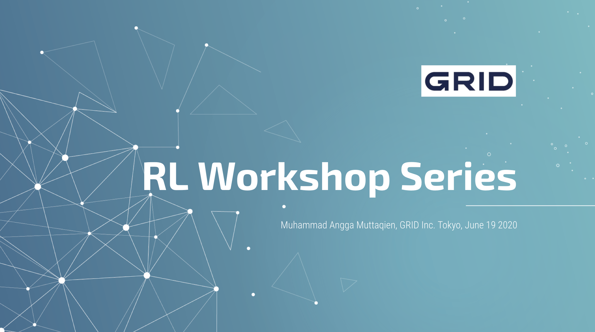

# RL-Workshop-Series
Code used for Reinforcement Learning related workshops for Project Analytics Group, GRID Inc.

# Installation

Install PyTorch and OpenAI's Gym on your machine. Detailed instruction:

* PyTorch: https://pytorch.org/get-started/locally
* Gym: https://gym.openai.com/docs/#installation

To make sure your Gym environment work properly (you can see game screen displayed when it's run), try to run this [notebooks](https://github.com/muhamuttaqien/RL-Workshop-Series/blob/master/part-1/rl-platforms/gym/00_init_atari_env.ipynb) on your local machine. 

# Part I: Introduction to Reinforcement Learning

## Implementation
Algorithms:
1. OpenAI Gym Env 
2. Monte Carlo for FrozenLake Env
3. Temporal Difference for Taxi Env
4. Deep Q-Network for CartPole Env
5. GA and PSO algorithms for Battleship Env

## Slides
Link to the presentation materials: http://bit.ly/rl-workshop-grid-part1

# Part II: Advanced Reinforcement Learning

## Implementation
Algorithms:
1. Variants of DQN
2. PPO
3. Actor-Critic
4. DDPG

## Slides
Link to the presentation materials: In progress
